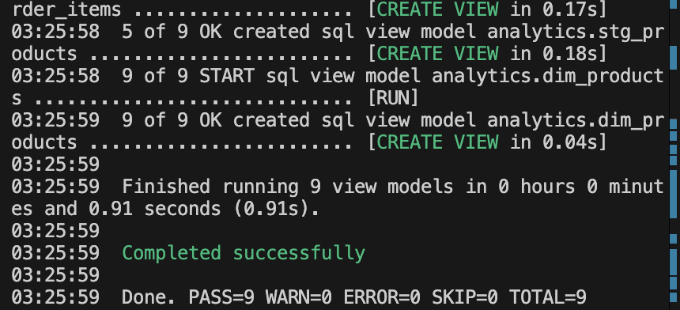
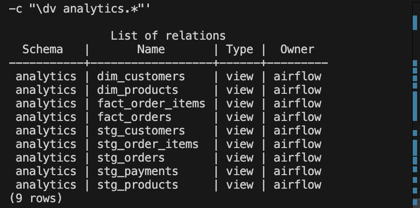

# End-to-End E-Commerce Data Engineering Pipeline

This project demonstrates a production-style data engineering pipeline that ingests raw e-commerce data, processes it through a modern ELT workflow, and makes it analytics-ready using industry-standard tools.

The goal of this project is to showcase:
   - Data ingestion & versioning
   - Orchestration with Airflow
   - Cloud storage using AWS S3
   - Data cleaning & standardization
   - Loading data into a warehouse staging layer
   - Analytics engineering with dbt
   - Data quality testing

---

## 🚀 Architecture Overview:
Local CSV Files
   ↓
Ingestion Scripts (Python)
   ↓
AWS S3 (Raw Layer)
   ↓
Cleaning & Standardization
   ↓
AWS S3 (Clean Layer)
   ↓
Load into Postgres (Stage Schema)
   ↓
dbt Transformations
   ↓
Postgres (Analytics Schema)

**Tech Stack**
- **Python** – ingestion, cleaning, loading
- **AWS S3** – raw + cleaned data storage
- **Apache Airflow** – orchestration
- **dbt** – transformations & tests
- **Postgres** – staging & analytics warehouse
- **Docker** – reproducible environment

---

## 🧩 Pipeline Flow

1. Generate run timestamp
   - Each pipeline run generates a single UTC timestamp used across all stages for traceability.

2. Ingestion
   - Reads local CSV files (orders, customers, products, payments, order_items)
   - Adds ingested_at metadata
   - Uploads versioned data to S3

3. Cleaning (Clean Layer)
   - Standardizes column names & data types
   - Handles nulls and duplicates
   - Writes curated data back to S3

4. Load to Warehouse (Stage Layer)
   - Clean data is loaded from S3 into Postgres stage schema
   - Tables are:
      -  Created once
      - Truncated & reloaded every run
   - This avoids breaking downstream dbt models while ensuring fresh data

   Schema:
      `stage.orders`
      `stage.order_items`
      `stage.payments`
      `stage.customers`
      `stage.products`

5. Analytics Modeling (dbt)
   dbt builds analytics views on top of the stage schema.
   Staging models:
      `stg_orders`
      `stg_order_items`
      `stg_payments`
      `stg_customers`
      `stg_products`

   Fact & Dimension models
      `fact_orders`
      `fact_order_items`
      `dim_customers`
      `dim_products`
   All models are created in the analytics schema.

6. Data Quality (dbt tests)
   Implemented tests:
      - not_null
      - unique
   Ensures:
      - Primary keys are valid
      - No missing critical fields

Orchestration with Airflow
  The full pipeline is automated using a single DAG:
   ecommerce_end_to_end
   DAG Tasks
      - generate_run_ts
      - ingest_raw_data
      - clean_raw_to_clean_s3
      - load_stage_postgres
      - dbt_run
      - dbt_test

---

## Repository Structure

ecommerce-data-pipeline/
│
├── airflow/
│   └── dags/
│       └── ecommerce_end_to_end.py
│
├── ingestion/
│   └── ingest_orders.py
│
├── transform/
│   ├── clean_tables.py
│   └── load_stage_postgres.py
│
├── ecommerce_dbt/
│   ├── models/
│   │   ├── staging/
│   │   └── marts/
│   └── tests/
│
└── data/
    └── raw/

## 📸 Pipeline Results

### Airflow – Successful DAG Run

### dbt – Transformations

### Analytics Layer
